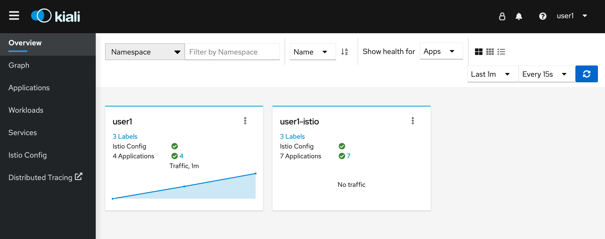
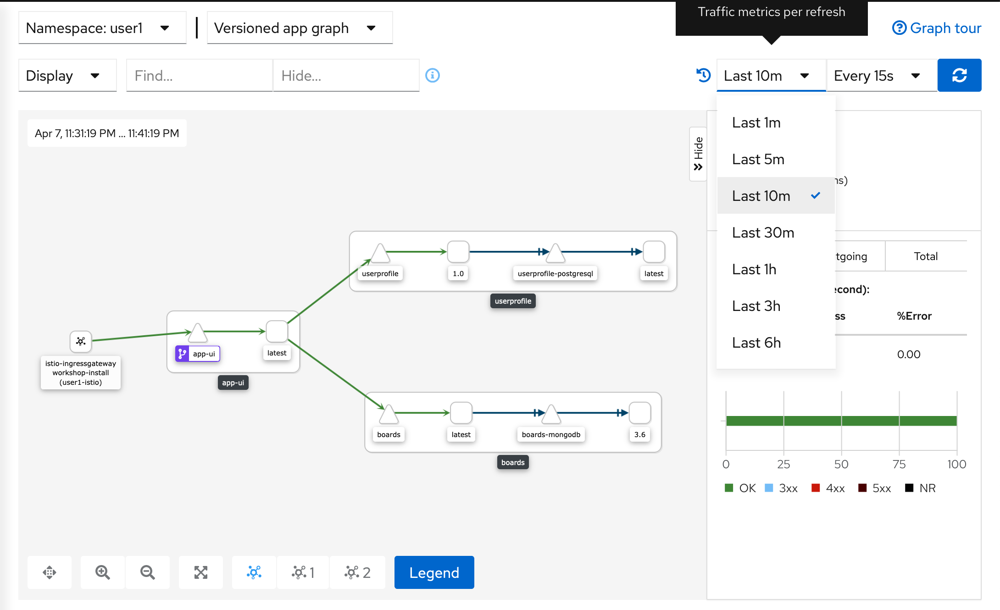
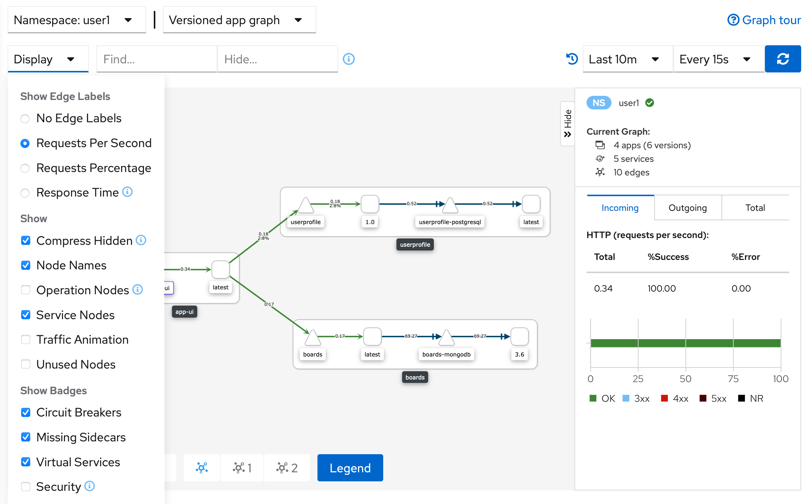
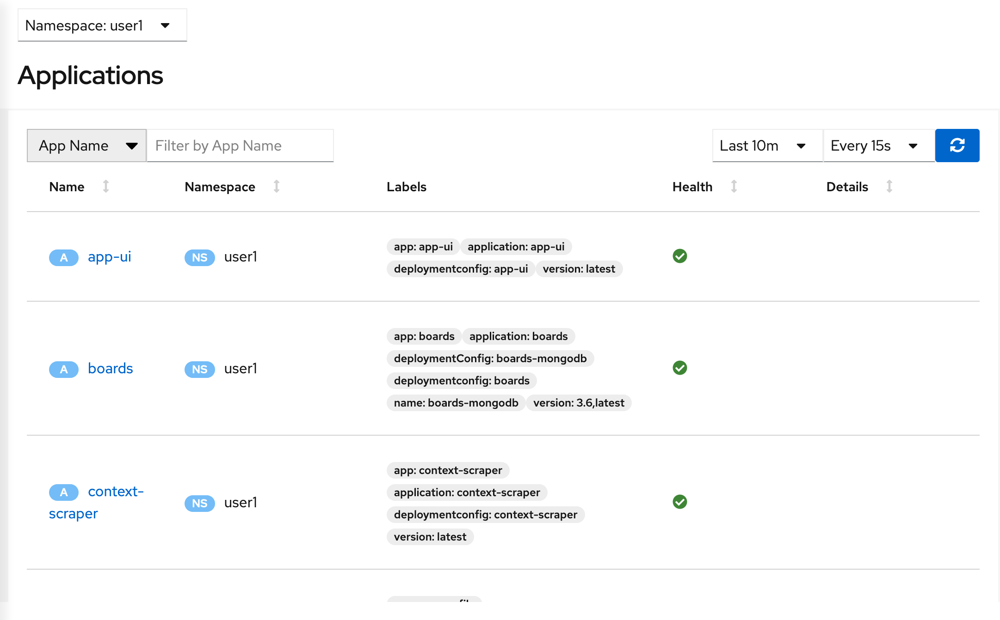
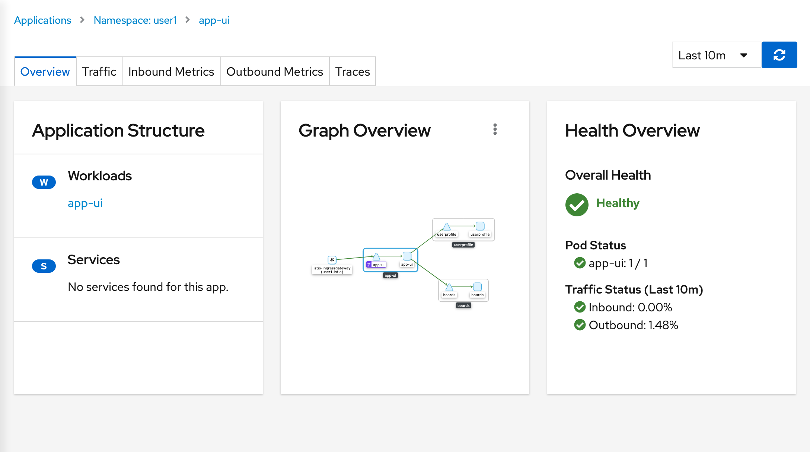

# Introducing Kiali for Observability

All of your microservices are running in the service mesh.  Now, you need a way to visualize the service mesh topology.  That is, what's running in your service mesh and how are they connected?

Istio provides [Kiali][1], an open source project that gives you a console view of your service mesh.  You can inspect the health of your service mesh, and it has further integrations for metric querying and tracing that we will cover in later labs.

## Explore Kiali

Ensure Kiali can view your deployments:

```execute
oc get cm kiali -n %username%-istio -o yaml | sed '/DeploymentConfig/d' | oc apply -n %username%-istio -f -
oc rollout restart deployment kiali -n %username%-istio
```

<br>

Let's send some load to the application.

<blockquote>
<i class="fa fa-terminal"></i>
Send load to the application user interface:
</blockquote>

```execute
for ((i=1;i<=100;i++)); do curl -s -o /dev/null $GATEWAY_URL; done
```

<blockquote>
<i class="fa fa-terminal"></i>
Send load to the user profile service:
</blockquote>

```execute
for ((i=1;i<=100;i++)); do curl -s -o /dev/null $GATEWAY_URL/profile; done
```

<br>

<blockquote>
<i class="fa fa-terminal"></i>
Now let's open the Kiali console.  Retrieve the endpoint for Kiali: 
</blockquote>


```execute
echo $(oc get route kiali -n %username%-istio --template='https://{{.spec.host}}')
```

Output (sample):
```
https://kiali-userx-istio.apps.cluster-naa-xxxx.naa-xxxx.example.opentlc.com
```

<blockquote>
<i class="fa fa-desktop"></i>
Navigate to this URL in the browser. Login with the same credentials you were provided to access OpenShift. 
</blockquote>

Once logged in, you should be presented with the Kiali console:

<br/>
*Kiali Welcome*

Let's take a look at the service mesh topology.  

<br>

<blockquote>
<i class="fa fa-desktop"></i>
Navigate to 'Graph' in the left navigation bar and select your namespace (e.g. user1).
</blockquote>

<blockquote>
<i class="fa fa-desktop"></i>
Now change the window of the view on the right side from 'Last 1m' to 'Last 10m'.
</blockquote>

<br/>
*Kiali Graph*

The graph shows the microservices in your service mesh and how they are connected.

You can inspect information about the traffic being sent between the services via the edge labels.  

<br>

<blockquote>
<i class="fa fa-desktop"></i>
Click 'Display' and switch to 'Request Rate' under 'Show Edge Labels'.
</blockquote>

You can now see HTTP traffic information between the microservices.

<br/>
*Kiali Graph with Request Rate*

Let's take a look at the microservices running in your service mesh.  

<br>

<blockquote>
<i class="fa fa-terminal"></i>
Navigate to  'Applications' in the left navigation bar.
</blockquote>

<br/>
*Kiali View of Applications*

<br>

<blockquote>
<i class="fa fa-terminal"></i>
You can drill down into each microservice from this view.  Select 'app-ui'.
</blockquote>


<br/>
*Kiali View of App UI*

You should see the 'Health' of that microservice.  

<br>

<blockquote>
<i class="fa fa-terminal"></i>
Navigate to the 'Traffic' tab and you should see the inbound and outbound calls made from that microservice.
</blockquote>

<br/>
*Kiali View of Inbound and Outbound Traffic to App UI*

<br>

[1]: https://kiali.io
